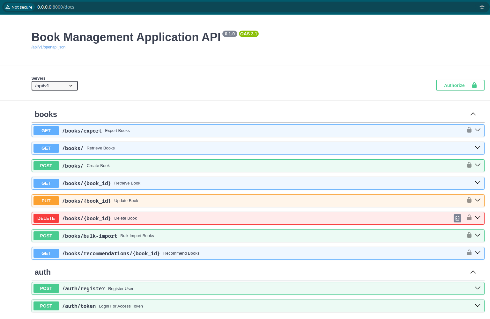

# Book Management System API

## Test task for Come Back Agency

A FastAPI-based REST API for managing books and authors with authentication, pagination, and sorting capabilities.

## Table of Contents

- [Task](#task)
- [Installation](#installation)
- [Run with docker](#run-with-docker)
- [Run migrations](#run-migrations)
- [Run tests](#run-tests)
- [Getting access](#getting-access)
- [Tech Stack](#tech-stack)
- [Features](#features)
- [Documentation](#documentation)
- [DB Structure](#db-structure)

## Task

## Installation

```bash
git clone https://github.com/AlexTsikhun/book-management-system
cd book-management-system
# SET ENV VARS, see `.env.sample` 
```

## Run with docker

```bash
docker compose build
docker compose up
```

Docker should be installed locally

## Run migrations

Run the Alembic Command:

```bash
docker compose exec app bash -c "PYTHONPATH=\$PYTHONPATH:src alembic revision --autogenerate -m 'Add relationship between models'"
```

Apply Migrations:

```bash
docker compose exec app bash -c "PYTHONPATH=\$PYTHONPATH:src alembic upgrade head"
```


## Run tests

Add path to `.env` files for test configuration

```bash
PYTHONPATH=$PYTHONPATH:src pytest --asyncio-mode=auto -sv
```
(At the moment, we are reworking the tests in order to correctly use the asynchronous test postgress database)

## Getting access

- Create user via `api/v1/auth/register/`
- Get access token `api/v1/auth/token/`
- API Root `api/v1/`

## Tech Stack

- FastAPI
- PostgreSQL
- SQLAlchemy
- Alembic
- Redis (for rate limiting)
- Docker & Docker Compose
- Pydantic
- pytest

## Features:

- User authentication with JWT tokens
- CRUD operations for books and authors
- Pagination and sorting for book retrieval
- Bulk import/export of books (JSON/CSV)
- Rate limiting
- PostgreSQL database with SQLAlchemy ORM
- Docker containerization
- Comprehensive test coverage
- Recomendation system (based on TF-IDF vectorization algorithm)


### Documentation

An example of using the API you can find here:

Swagger UI: http://localhost:8000/api/v1/docs

ReDoc: http://localhost:8000/api/v1/redoc

#### DB Structure:


Swager docs image:



<details style="border: 1px solid #ccc; padding: 10px; margin-bottom: 10px">
<summary style="font-size: 1.17em; font-weight: bold; ">Future work</summary>

- Deploy to AWS

</details>
